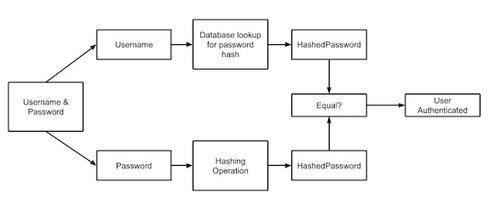
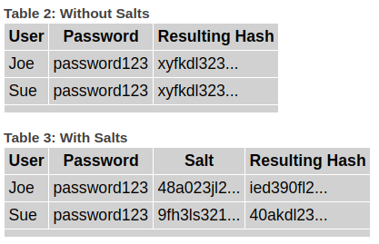

# Safely Storing User Passwords: Hashing vs. Encrypting

Securing user information begins with a proper understanding of security controls and the protection of user passwords using modern hashing algorithms. Here's a quick review of the fundamentals.

Over the past several months, we've seen major breaches exposing numerous usernames and passwords. The eBay and Adobe breaches impacted millions of accounts. Snapchat was compromised. With every password breach comes the inevitable question: Were the passwords stored securely? Unfortunately, this simple question is not simply answered.

Though hashing and encryption both provide valuable capabilities, for the vast majority of situations, there is only one right option for storing user passwords for an online application: hashing. This is a one-way function in which a hashed value cannot be reversed to obtain the original input value (i.e., the password). Symmetric encryption is based on the use of an encryption key and is a reversible operation. Anyone possessing the key can decrypt an encrypted value to obtain the original value.

**Table 1: Differences Between Hashing and Symmetric Encryption**

**How does the application authenticate a user with a password hash?**\
When the application receives a username and password from a user, it performs the hashing operation on the password and compares the resulting hashed value with the password hash stored in the database for the particular user. If the two hashes are an exact match, the user provided a valid username and password.

The benefit of hashing is that the application never needs to store the clear text password. It stores only the hashed value.

**Is all hashing created equal?**\
No. In fact, hashing algorithms can be very different, and not all are appropriate for password storage.

**Speed and iterative hashing algorithms**\
This may be a bit counterintuitive, but older hashing algorithms are too fast. Attackers may not be able to reverse a hashed value to obtain the original input, but they could perform a brute force attack that hashes numerous possible password inputs and checks if they match any of the stolen hashes.

To combat this threat, modern hashing algorithms can perform multiple iterations. This introduces a minor delay for a single hashing operation, but this small delay becomes massive if an attacker is performing a brute force attack. Consequently, iterative hashing algorithms make brute force attacks unrealistic, since they would require hundreds of years or more to complete.

**Does account lockout have any impact on the security model of password storage?**\
In short, no. The goal of securely storing passwords is to provide additional defense in the event the password file is ever stolen.

Attacks against password hashes are offline attacks. This means the attackers have already stolen the password file and are using their own computer to attempt various password combinations to find a hash in the stolen password hash file. Since this is an offline attack, controls such as account lockout or captchas provide no value. Those controls are valid only for online attacks against the login page of a running web server.

**What are the risks of using symmetric encryption instead of hashing?**\
By design, symmetric encryption is a reversible operation. This means that the encryption key must be accessible to the application and will be used for every password verification.

If the encrypted passwords are stolen, the attackers only need to determine the symmetric key used by the application. Once that key becomes known, through a breach or through brute force attacks on a weak key, all passwords are instantly decrypted and accessible. This is not a good place to be.

**Moral of the story**\
To store user passwords safely, it is critical to understand the differences between symmetric encryption and hashing. Algorithms such as PBKDF2, bcrypt, and scrypt all utilize per user salts and iterative hashing capabilities to store passwords securely.

The Internet and web applications will become even more important parts of everyday life as they are trusted with increasingly sensitive information. It is imperative that developers and application owners ensure they are doing everything they can to secure user information. This starts with a proper understanding of fundamental security controls and the protection of user passwords using modern hashing algorithms.