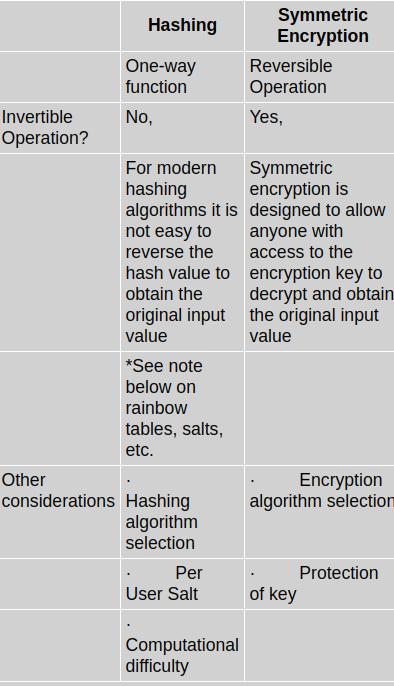

# Safely Storing User Passwords: Hashing vs. Encrypting

<b> Securing user information begins with a proper understanding of security controls and the protection of user passwords using modern hashing algorithms. Here's a quick review of the fundamentals. </b>

Over the past several months, we've seen major breaches exposing numerous usernames and passwords. The eBay and Adobe breaches impacted millions of accounts. Snapchat was compromised. With every password breach comes the inevitable question: Were the passwords stored securely? Unfortunately, this simple question is not simply answered.

Though hashing and encryption both provide valuable capabilities, for the vast majority of situations, there is only one right option for storing user passwords for an online application: hashing. This is a one-way function in which a hashed value cannot be reversed to obtain the original input value (i.e., the password). Symmetric encryption is based on the use of an encryption key and is a reversible operation. Anyone possessing the key can decrypt an encrypted value to obtain the original value.

<h5>Table 1: Differences Between Hashing and Symmetric Encryption

